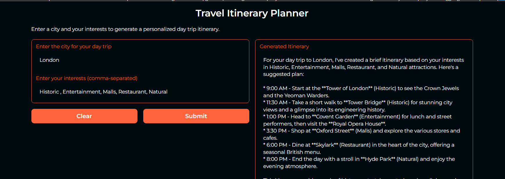

# TravelPlannerAI

A Gradio-based web application that generates personalized day trip itineraries using LangChain and LLM. Simply input a city and your interests to receive a customized travel plan.

#### Features

🌍 City-based itinerary generation

🎯 Interest-based customization

📋 Bullet-point formatted plans

🖥️ Clean web interface using Gradio

#### Project Demo

#### How It Works
User enters a destination city

User lists their interests (comma-separated)

LLM generates a personalized itinerary

Results are displayed in an easy-to-read format
